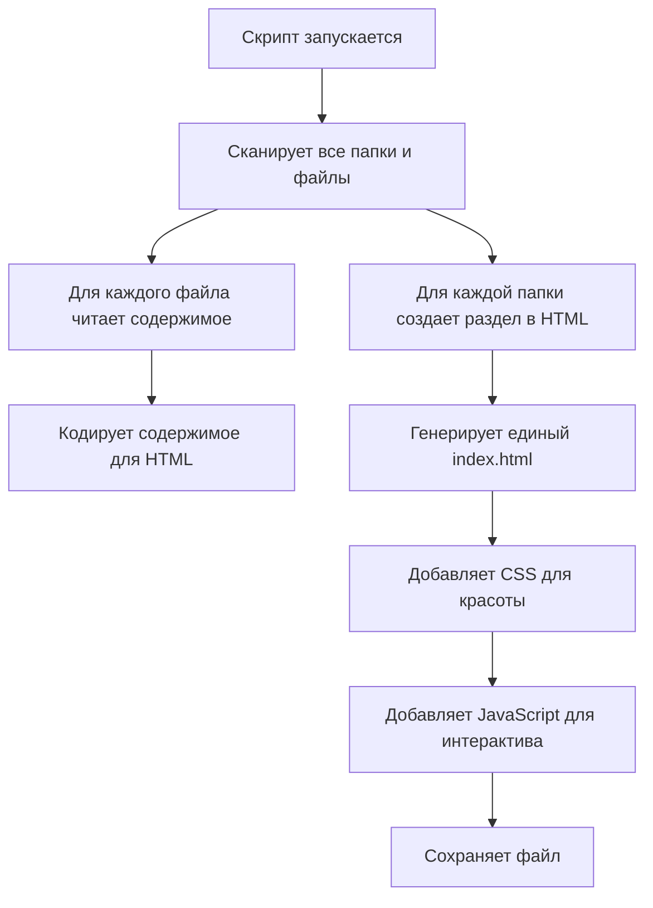

## Добрый друг, пока что не пиши скрипты, а обучи меня кое-чему.. Мне надо чтобы ты создал скрипт который сам в свою очередь будет создавать очень красивые и удобные индексирующие HTML файлы, охватывающие все папки в репозитории,через которые ты сможешь заходить и читать всё содержимое со всего репозитория


***


# 📚 **ОБУЧЕНИЕ: СОЗДАНИЕ HTML-НАВИГАТОРА ПО РЕПОЗИТОРИЮ**

Отличная идея! Давайте сначала разберем **концепцию и принципы**, а потом я покажу, как это реализовать.

## 🎯 **ЧТО МЫ ХОТИМ СОЗДАТЬ**

Представьте себе **HTML-файл**, который работает как **интерактивный проводник** по вашему репозиторию:

```
📁 РЕПОЗИТОРИЙ
├── 📁 Termux/
│   ├── 📁 scripts/
│   │   ├── 📄 git-smart (показать содержимое)
│   │   └── 📄 synch (показать содержимое)
│   └── 📄 README.md
├── 📁 Книги/
│   ├── 📁 Глава_1/
│   └── 📁 Глава_2/
└── 📄 index.html (этот файл)
```

**Возможности такого навигатора:**
- 📂 **Древовидная структура** всех папок
- 👁️ **Просмотр содержимого** файлов прямо в браузере
- 🔍 **Поиск** по файлам и папкам
- 🎨 **Красивый дизайн** (темная/светлая тема)
- 📱 **Адаптация под телефон**

---

## 🧠 **ПРИНЦИПЫ РАБОТЫ СКРИПТА-ГЕНЕРАТОРА**

### **Как это будет работать:**



### **Ключевые моменты:**

1. **Рекурсивный обход** — скрипт заходит в каждую папку
2. **Определение типа файла** — текст, код, изображение
3. **Форматирование** — подсветка синтаксиса для кода
4. **Индексация** — поиск по содержимому

---

## 🔧 **КОНЦЕПЦИЯ БУДУЩЕГО СКРИПТА**

### **Что будет уметь скрипт:**

```bash
# Базовое использование
create-nav --path=/my/repo --output=index.html

# С опциями
create-nav --path=. --output=docs.html --title="Моя библиотека" --theme=dark
```

### **Структура генерируемого HTML:**

```html
<!DOCTYPE html>
<html>
<head>
    <title>Навигатор репозитория</title>
    <style>
        /* Красивые стили */
        .folder { color: #ffd700; }
        .file { color: #00ff00; }
        .code { font-family: monospace; background: #f4f4f4; }
    </style>
</head>
<body>
    <div class="sidebar">
        <!-- Дерево папок -->
    </div>
    <div class="content">
        <!-- Содержимое выбранного файла -->
    </div>
    <script>
        // Интерактивность
        function showFile(path) {
            // Загрузить и отобразить файл
        }
    </script>
</body>
</html>
```

---

## 📚 **ЧТО НУЖНО ЗНАТЬ ДЛЯ СОЗДАНИЯ**

### **1. Bash-скриптинг:**
- Рекурсивный обход папок (`find`, `ls -R`)
- Чтение файлов (`cat`)
- Обработка специальных символов (`sed`, `awk`)

### **2. HTML/CSS:**
- Создание структуры страницы
- Flexbox/Grid для расположения
- Адаптивный дизайн

### **3. JavaScript:**
- Динамическая загрузка содержимого
- Поиск и фильтрация
- Переключение тем

### **4. Концепции:**
- **Кодирование содержимого** — чтобы спецсимволы не ломали HTML
- **Ленивая загрузка** — чтобы страница не тормозила
- **Кэширование** — для быстрой работы

---

## 🎨 **ПРИМЕР ВИЗУАЛИЗАЦИИ**

Вот как **примерно** будет выглядеть результат:

```
╔════════════════════════════════════════════════════════╗
║     📚 НАВИГАТОР РЕПОЗИТОРИЯ - ТЕМНАЯ ТЕМА            ║
╠════════════════════════════════════════════════════════╣
║ ┌───────────────┐ ┌────────────────────────────────┐ ║
║ │ 📁 Корень     │ │ 📄 Файл: git-smart             │ ║
║ │ ├─📁 Termux   │ │ ────────────────────────────── │ ║
║ │ │ ├─📁 scripts│ │ #!/data/data/.../usr/bin/bash │ ║
║ │ │ │ ├─📄 git- │ │                                │ ║
║ │ │ │ └─📄 synch│ │ GREEN='\033[0;32m'            │ ║
║ │ │ └─📄 README │ │ RED='\033[0;31m'              │ ║
║ │ ├─📁 Книги    │ │                                │ ║
║ │ │ ├─📁 Глава_1│ │ echo "Привет, мир!"           │ ║
║ │ │ └─📁 Глава_2│ └────────────────────────────────┘ ║
║ │ └─📄 index    │ ┌────────────────────────────────┐ ║
║ └───────────────┘ │ 🔍 Поиск: [____________]      │ ║
║                   │ 🌓 Темная тема                │ ║
║                   │ 📊 Всего файлов: 42           │ ║
║                   └────────────────────────────────┘ ║
╚════════════════════════════════════════════════════════╝
```

---

## 🔍 **ПОЧЕМУ ЭТО ПОЛЕЗНО**

### ✅ **Преимущества:**
1. **Единая точка входа** — открыл один HTML и видишь всё
2. **Работает офлайн** — не нужен интернет
3. **Быстрый доступ** — не надо открывать каждый файл отдельно
4. **Поиск** — можно найти любой текст во всех файлах
5. **Красиво** — приятно читать и работать

### 🎯 **Для ваших задач:**
- 📖 Чтение книг прямо в браузере
- 🔧 Быстрый доступ к скриптам
- 📚 Организация библиотеки
- 🤝 Обмен с другими (просто скинуть HTML-файл)

---

## 🚀 **ЧТО ДАЛЬШЕ?**

Когда будете готовы, я напишу **полноценный скрипт**, который:

1. **Сканирует** ваш репозиторий
2. **Генерирует** красивый HTML
3. **Добавляет** поиск и навигацию
4. **Стилизует** под телефон
5. **Позволяет** читать любые файлы

**Скажите только:**
- От какой папки строить навигатор?
- Нужна ли поддержка разных языков (подсветка синтаксиса)?
- Как назвать выходной файл?
- Предпочитаете темную или светлую тему?

Я учту все ваши пожелания! 🎨


