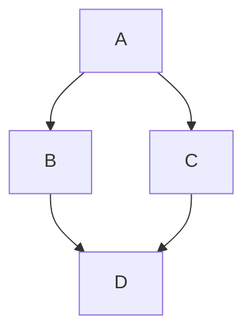

---

## **КНИГА О MARKDOWN: ПОЛНОЕ РУКОВОДСТВО**
*От основ до профессионального использования*

### **Содержание**

1.  **Введение в Markdown**
    *   1.1 Что такое Markdown и зачем он нужен?
    *   1.2 Преимущества перед HTML и Word
    *   1.3 Где используется Markdown?
    *   1.4 Экосистема: диалекты, редакторы, конвертеры

2.  **Базовый синтаксис (The Absolute Essentials)**
    *   2.1 Заголовки
    *   2.2 Выделение текста (жирный, курсив)
    *   2.3 Списки (маркированные и нумерованные)
    *   2.4 Ссылки и изображения
    *   2.5 Цитаты
    *   2.6 Код (встроенный и блоки)
    *   2.7 Горизонтальные разделители

3.  **Расширенный синтаксис (По версии GFM и других диалектов)**
    *   3.1 Таблицы
    *   3.2 Зачеркнутый текст
    *   3.3 Списки задач (Task Lists)
    *   3.4 Подсветка кода в блоках
    *   3.5 Автоматические ссылки
    *   3.6 Эмодзи (Emoji)

4.  **Продвинутые техники и обходные пути**
    *   4.1 Встраивание HTML
    *   4.2 Сноски (Footnotes)
    *   4.3 Определения терминов (Definition Lists)
    *   4.4 Верхние и нижние индексы
    *   4.5 Комментарии в Markdown

5.  **Специализированные возможности (Платформенные расширения)**
    *   5.1 Блоки предупреждений (Notes, Tips, Warnings) от Microsoft
    *   5.2 Сворачиваемые секции (Collapsible sections)
    *   5.3 Вкладки (Tabs)
    *   5.4 Значки (Badges)
    *   5.5 Упоминания пользователей и ссылки на задачи (@mentions, #issues)

6.  **Технический и научный Markdown**
    *   6.1 Математические формулы (LaTeX)
    *   6.2 Диаграммы (Mermaid)
    *   6.3 Встраивание видео и аудио

7.  **Практикум: Создание идеального документа**
    *   7.1 Правила оформления заголовков (Microsoft Style Guide)
    *   7.2 Работа с изображениями
    *   7.3 Ограничение длины строки
    *   7.4 Использование пробелов и пустых строк

8.  **Инструментарий: От текста к книге**
    *   8.1 Редакторы: От Блокнота до Obsidian
    *   8.2 Конвертеры: Магия Pandoc
    *   8.3 Генераторы статических сайтов (MkDocs, Hugo)

9.  **Заключение и шпаргалки**

---


## **КНИГА О MARKDOWN: ПОЛНОЕ РУКОВОДСТВО**
*От основ до профессионального использования*

---

# **ГЛАВА 1: ВВЕДЕНИЕ В MARKDOWN**

---

## **1.1 Что такое Markdown и зачем он нужен?**

**Markdown** — это облегченный язык разметки, созданный Джоном Грубером (John Gruber) и Аароном Шварцем (Aaron Swartz) в 2004 году. Их главная цель была сформулирована предельно четко: **"писать текст так же легко, как писать email, но при этом иметь возможность превратить его в красивый HTML".**

### **Философия Markdown в двух предложениях:**

> *   **Для чтения:** Исходный текст должен быть читаемым и понятным "как есть", без необходимости смотреть на "скомпилированный" результат.
> *   **Для написания:** Символы разметки должны быть интуитивно понятными и минимально навязчивыми.

### **Зачем он нужен?**

1.  **Скорость написания:** Вы не отвлекаетесь на меню, кнопки и мышку. Все форматирование делается парой символов прямо во время печати.
2.  **Чистота исходного кода:** Сравните Markdown и HTML:
    *   **Markdown:** `# Заголовок`
    *   **HTML:** `<h1>Заголовок</hh1>`
3.  **Универсальность:** Markdown можно конвертировать во что угодно: HTML, PDF, DOCX, EPUB и даже в слайды для презентаций. Это делает его идеальным "единым источником правды" для документов.
4.  **Будущее-proof:** Это простой текст. Вы сможете открыть и прочитать его через 50 лет на любом устройстве, в отличие от закрытых бинарных форматов (например, `.docx`, который по сути является zip-архивом с XML внутри).

---

## **1.2 Преимущества перед HTML и Word**

Давайте посмотрим на сравнительную таблицу, чтобы понять, почему Markdown стал стандартом де-факто для документации, блогов и, как в вашем случае, для написания книг.

| Критерий | Markdown | HTML | Microsoft Word (и аналоги) |
| :--- | :--- | :--- | :--- |
| **Скорость набора** | 🔥 **Максимальная**. Руки не отрываются от клавиатуры. | 🐢 Низкая. Требует закрытия тегов, постоянного переключения внимания. | 🐌 Средняя. Постоянные отвлечения на панели инструментов и мышку. |
| **Читаемость кода** | 🔥 **Исходный код читается как обычный текст**. | 🚫 Плохая. Теги визуально "шумят" и затрудняют чтение. | 🚫 **Исходный код не предназначен для чтения**. Это бинарный XML-архив. |
| **Портативность** | 🔥 **Максимальная**. Любой текстовый редактор откроет. | 🔥 Тоже текст, но громоздкий. | 🚫 Низкая. Требуется специальное ПО. |
| **Контроль версий (Git)** | 🔥 **Идеален**. Diff показывает именно изменения текста. | 🐢 Сложный. Diff часто бесполезен из-за шума. | 🚫 **Практически невозможен**. Diff показывает бинарные изменения. |
| **Дизайн и верстка** | 🐢 Ограничен базовыми элементами. Сложная верстка требует HTML/CSS. | 🔥 **Полный контроль** над каждым пикселем. | 🔥 **WYSIWYG** (What You See Is What You Get). Легко делать сложную верстку, но сложно контролировать. |
| **Целевая аудитория** | Разработчики, технические писатели, ученые, **авторы книг**. | Веб-разработчики. | Офисные сотрудники, дизайнеры, верстальщики. |

**Вывод:** Markdown — это золотая середина между удобством написания и мощью конечного результата. Вы пишете в Markdown, а финальный "красивый" документ (книгу) получаете с помощью конвертера (например, Pandoc), который мы подробно разберем позже.

---

## **1.3 Где используется Markdown?**

Markdown настолько популярен, что вы сталкиваетесь с ним каждый день, возможно, даже не подозревая об этом.

*   **Платформы для разработчиков:**
    *   **GitHub / GitLab / Bitbucket:** Файлы `README.md` — это визитная карточка любого проекта. Issues, Pull Requests, Wiki — все пишется на Markdown.
    *   **Stack Overflow:** Вопросы и ответы форматируются с помощью Markdown.
*   **Блоги и CMS:**
    *   **Ghost, Jekyll, Hugo, Gatsby:** Многие современные платформы для блогов используют Markdown как основной язык для написания постов.
*   **Мессенджеры и заметки:**
    *   **Telegram, Discord, Slack, WhatsApp, Signal:** Поддерживают базовое форматирование Markdown (жирный, курсив, списки).
    *   **Obsidian, Roam Research, Logseq:** Приложения для ведения "второго мозга" целиком построены на Markdown.
*   **Научная среда:**
    *   **Jupyter Notebooks, R Markdown:** Стандарт для воспроизводимых исследований (Literate Programming).
*   **Ваша задача:** Написание и конвертация книг с помощью Pandoc.

---

## **1.4 Экосистема: диалекты, редакторы, конвертеры**

Markdown — это не единый стандарт, а, скорее, "стандарт де-факто" с множеством диалектов (flavors), которые добавляют свои расширения.

### **1.4.1 Основные диалекты (Flavors)**

1.  **Original Markdown (John Gruber):** Базовая, минимальная спецификация. Ее возможностей часто не хватает для реальных задач (например, нет таблиц).
2.  **CommonMark:** Попытка создать однозначную, строгую спецификацию Markdown без двусмысленностей.
3.  **GFM (GitHub Flavored Markdown):** Самый популярный диалект. Добавляет к CommonMark таблицы, списки задач, зачеркивание, подсветку синтаксиса и многое другое. Мы будем ориентироваться в основном на него.
4.  **MultiMarkdown:** Добавляет сноски, определения терминов, метаданные, математику и т.д.
5.  **Pandoc Markdown:** Самый мощный из существующих. Pandoc (конвертер) имеет свой собственный диалект, который вбирает в себя возможности почти всех остальных и добавляет множество уникальных расширений (таблицы разных типов, атрибуты блоков, фильтры и пр.). Именно с ним мы будем работать чаще всего.

### **1.4.2 Редакторы**

*   **Простые текстовые:** Блокнот, Notepad++, Vim, Nano.
*   **С подсветкой синтаксиса:** VS Code, Sublime Text, Atom.
*   **Специализированные:**
    *   **Typora:** Минималистичный редактор с режимом "фокус" (исчезающая разметка).
    *   **Obsidian / Roam Research:** Для создания сети заметок (Zettelkasten).
    *   **iA Writer / Ulysses:** Для писателей.
    *   **StackEdit:** Онлайн-редактор с синхронизацией.

### **1.4.3 Конвертеры**

*   **Pandoc:** "Швейцарский нож" конвертации документов. Умеет превращать Markdown во все, что угодно, и наоборот. Это наш главный инструмент. Мы посвятим ему отдельную главу.
*   **MultiMarkdown:** Специализированный конвертер, ориентированный на создание сложных научных и академических текстов.
*   **Специализированные утилиты:** Встроенные конвертеры на сайтах (GitHub, StackEdit) и в приложениях (Typora).

---


## **КНИГА О MARKDOWN: ПОЛНОЕ РУКОВОДСТВО**

---

# **ГЛАВА 2: БАЗОВЫЙ СИНТАКСИС (THE ABSOLUTE ESSENTIALS)**

---

## **2.1 Заголовки (Headers)**

Заголовки — это основа структуры любого документа. В Markdown они создаются с помощью символа решетки (`#`). Количество решеток соответствует уровню заголовка (от 1 до 6).

### **Синтаксис:**

```markdown
# Заголовок 1-го уровня (самый главный)
## Заголовок 2-го уровня
### Заголовок 3-го уровня
#### Заголовок 4-го уровня
##### Заголовок 5-го уровня
###### Заголовок 6-го уровня
```

### **Как это выглядит:**

# Заголовок 1-го уровня
## Заголовок 2-го уровня
### Заголовок 3-го уровня
#### Заголовок 4-го уровня
##### Заголовок 5-го уровня
###### Заголовок 6-го уровня

### **Важные правила:**

1.  **Пробел обязателен:** Между решетками и текстом **обязательно** должен быть пробел. `#Заголовок` работать не будет.
2.  **Иерархия:** Не рекомендуется прыгать с уровня 1 на уровень 3. Старайтесь соблюдать логическую структуру.
3.  **Альтернативный синтаксис (для H1 и H2):** Для заголовков первого и второго уровня существует альтернативный способ с использованием знаков равенства и дефисов:

```markdown
Заголовок 1-го уровня
======================

Заголовок 2-го уровня
----------------------
```

---

## **2.2 Выделение текста (Emphasis)**

### **2.2.1 Курсив (Italic)**

Текст выделяется курсивом с помощью одной звездочки (`*`) или одного подчеркивания (`_`) с обеих сторон фразы.

```markdown
*Этот текст будет курсивом*
_Этот текст тоже будет курсивом_
```

*Результат:* *Этот текст будет курсивом* и _Этот текст тоже будет курсивом_.

### **2.2.2 Полужирный (Bold)**

Текст делается полужирным с помощью двух звездочек (`**`) или двух подчеркиваний (`__`).

```markdown
**Этот текст будет полужирным**
__Этот текст тоже будет полужирным__
```

*Результат:* **Этот текст будет полужирным** и __Этот текст тоже будет полужирным__.

### **2.2.3 Полужирный курсив (Bold and Italic)**

Комбинация трех звездочек или трех подчеркиваний.

```markdown
***Этот текст будет полужирным курсивом***
___И этот тоже___
```

*Результат:* ***Этот текст будет полужирным курсивом*** и ___И этот тоже___.

### **Важное правило о подчеркиваниях:**

Если вы используете подчеркивания (`_`) внутри слова, будьте осторожны. Markdown может посчитать это началом выделения.

```markdown
Неправильно: при_вет_ (получится "привет")
Правильно: при\_вет (нужно экранировать обратным слешем)
```

---

## **2.3 Списки (Lists)**

### **2.3.1 Маркированные списки (Unordered Lists)**

Создаются с помощью звездочки (`*`), плюса (`+`) или дефиса (`-`). Все три символа работают одинаково.

```markdown
* Пункт 1
* Пункт 2
  * Вложенный пункт 2.1 (с отступом в 2 или 4 пробела)
  * Вложенный пункт 2.2
* Пункт 3

- Тоже маркированный список
- С другим символом

+ И еще один вариант
+ Тоже работает
```

*Результат:*
* Пункт 1
* Пункт 2
  * Вложенный пункт 2.1
  * Вложенный пункт 2.2
* Пункт 3

### **2.3.2 Нумерованные списки (Ordered Lists)**

Создаются с помощью чисел и точки. Сами числа не важны — Markdown нумерует автоматически по порядку.

```markdown
1. Первый пункт
2. Второй пункт
3. Третий пункт
   1. Вложенный пункт 3.1 (с отступом)
   2. Вложенный пункт 3.2
4. Четвертый пункт
```

*Результат:*
1. Первый пункт
2. Второй пункт
3. Третий пункт
   1. Вложенный пункт 3.1
   2. Вложенный пункт 3.2
4. Четвертый пункт

**Хитрость:** Чтобы список выглядел аккуратно, можно использовать одинаковые числа:

```markdown
1. Пункт 1
1. Пункт 2
1. Пункт 3
```

Всё равно получится:
1. Пункт 1
2. Пункт 2
3. Пункт 3

---

## **2.4 Ссылки и изображения (Links and Images)**

### **2.4.1 Текстовые ссылки**

Синтаксис: `[текст ссылки](URL "необязательный заголовок")`

```markdown
[Яндекс](https://ya.ru)
[Google](https://google.com "Поисковая система Google")
```

*Результат:* [Яндекс](https://ya.ru) и [Google](https://google.com "Поисковая система Google")

### **2.4.2 Ссылки через ссылки (Reference-style Links)**

Полезно для документов, где один и тот же URL используется много раз.

```markdown
Я люблю [Яндекс][1] и [Google][2]. А еще я часто захожу на [Яндекс][1] снова.

[1]: https://ya.ru "Яндекс"
[2]: https://google.com "Гугл"
```

*Результат:* Я люблю [Яндекс][1] и [Google][2]. А еще я часто захожу на [Яндекс][1] снова.

[1]: https://ya.ru "Яндекс"
[2]: https://google.com "Гугл"

Можно использовать и текстовые метки:

```markdown
Я люблю [Яндекс] и [Google].

[Яндекс]: https://ya.ru
[Google]: https://google.com
```

### **2.4.3 Изображения**

Синтаксис почти такой же, как у ссылок, но с восклицательным знаком в начале: ``

```markdown

```

*Результат:*


### **2.4.4 Изображения-ссылки**

Чтобы сделать картинку кликабельной, просто оберните Markdown изображения в синтаксис ссылки.

```markdown
[](https://ru.wikipedia.org/wiki/Markdown)
```

*Результат:* [](https://ru.wikipedia.org/wiki/Markdown)

---

## **2.5 Цитаты (Blockquotes)**

Для цитирования используется символ `>` в начале строки.

```markdown
> Это цитата. Она может быть длинной и занимать несколько строк.
> Для продолжения цитаты на новой строке тоже нужно ставить `>`.

> Можно делать вложенные цитаты:
>> Вложенная цитата первого уровня.
>>> Вложенная цитата второго уровня.
```

*Результат:*
> Это цитата. Она может быть длинной и занимать несколько строк.
> Для продолжения цитаты на новой строке тоже нужно ставить `>`.
>
> Можно делать вложенные цитаты:
>> Вложенная цитата первого уровня.
>>> Вложенная цитата второго уровня.

---

## **2.6 Код (Code)**

### **2.6.1 Встроенный код (Inline Code)**

Для выделения кода внутри строки используются обратные кавычки (`` ` ``).

```markdown
Команда `git status` показывает состояние репозитория.
```

*Результат:* Команда `git status` показывает состояние репозитория.

### **2.6.2 Блоки кода (Code Blocks)**

Есть два способа:

1.  **С отступом (классический):** Отступ в 4 пробела или одна табуляция.

```markdown
    Это блок кода.
    Он сохраняет все пробелы и переносы.
        А это уже вложенный отступ.
```

2.  **С "заборчиками" (fenced code blocks):** Три обратные кавычки ` ``` ` до и после блока. Этот способ предпочтительнее, так как позволяет указать язык для подсветки синтаксиса.

    ```markdown
    ```python
    def hello():
        print("Привет, мир!")
    ```
    ```

*Результат:*
```python
def hello():
    print("Привет, мир!")
```

---

## **2.7 Горизонтальные разделители (Horizontal Rules)**

Создаются тремя или более дефисами (`---`), звездочками (`***`) или подчеркиваниями (`___`) на отдельной строке.

```markdown
Текст выше разделителя.

---

Текст после разделителя.
```

*Результат:*
Текст выше разделителя.

---

Текст после разделителя.

---


## **КНИГА О MARKDOWN: ПОЛНОЕ РУКОВОДСТВО**

---

# **ГЛАВА 3: РАСШИРЕННЫЙ СИНТАКСИС (ПО ВЕРСИИ GFM И ДРУГИХ ДИАЛЕКТОВ)**

---

Базового синтаксиса часто недостаточно для реальных задач. К счастью, существуют расширения — дополнительные элементы разметки, которые делают Markdown по-настоящему мощным инструментом. Самый популярный диалект — **GitHub Flavored Markdown (GFM)** — добавил большинство из этих возможностей.

---

## **3.1 Таблицы (Tables)**

Таблицы — одна из самых востребованных функций, которой нет в оригинальном Markdown. GFM ввел простой и интуитивный синтаксис для их создания.

### **Синтаксис:**

```markdown
| Заголовок 1 | Заголовок 2 | Заголовок 3 |
|--------------|:------------:|--------------:|
| Ячейка 1     | Ячейка 2     | Ячейка 3     |
| Ячейка 4     | Ячейка 5     | Ячейка 6     |
| Ячейка 7     | Ячейка 8     | Ячейка 9     |
```

### **Как это выглядит:**

| Заголовок 1 | Заголовок 2 | Заголовок 3 |
|--------------|:------------:|--------------:|
| Ячейка 1     | Ячейка 2     | Ячейка 3     |
| Ячейка 4     | Ячейка 5     | Ячейка 6     |
| Ячейка 7     | Ячейка 8     | Ячейка 9     |

### **Выравнивание:**

Двоеточия (`:`) в строке, отделяющей заголовки от содержимого, управляют выравниванием текста в столбцах:

*   `:---` — выравнивание по левому краю (по умолчанию).
*   `:---:` — выравнивание по центру.
*   `---:` — выравнивание по правому краю.

### **Пример с разным выравниванием:**

```markdown
| Лево | Центр | Право |
|:-----|:-----:|------:|
| Текст | Текст | Текст |
| Длинный текст | Длинный текст | Длинный текст |
```

*Результат:*

| Лево | Центр | Право |
|:-----|:-----:|------:|
| Текст | Текст | Текст |
| Длинный текст | Длинный текст | Длинный текст |

### **Важные правила:**

1.  **Строка разделителя обязательна.** Без нее Markdown не поймет, что это таблица.
2.  **Количество ячеек в каждой строке должно совпадать.** Иначе таблица может "сломаться".
3.  **Перенос строк внутри ячейки** возможен, но требует использования HTML-тега `<br>`.

---

## **3.2 Зачеркнутый текст (Strikethrough)**

Позволяет перечеркнуть текст. Полезно для обозначения устаревшей информации, выполненных задач (в сочетании со списками) или просто для выделения правок.

### **Синтаксис:**

```markdown
~~Этот текст будет зачеркнут.~~
```

### **Как это выглядит:**

~~Этот текст будет зачеркнут.~~

---

## **3.3 Списки задач (Task Lists)**

Интерактивные чек-боксы, которые отображаются на GitHub и в других поддерживающих платформах. Они кликабельны в веб-интерфейсе.

### **Синтаксис:**

Используются дефис (`-`), пробел, квадратные скобки с пробелом для пустого чек-бокса, или с `x` для отмеченного.

```markdown
- [x] Написать главу 1
- [x] Написать главу 2
- [ ] Написать главу 3
- [ ] Отредактировать главу 4
```

### **Как это выглядит:**

- [x] Написать главу 1
- [x] Написать главу 2
- [ ] Написать главу 3
- [ ] Отредактировать главу 4

### **Важное правило:**

Они работают только внутри списков (маркированных или нумерованных). Отступы важны для вложенных задач.

```markdown
- [x] Основные задачи
  - [ ] Подзадача 1
  - [x] Подзадача 2
- [ ] Следующая задача
```

---

## **3.4 Подсветка кода в блоках (Syntax Highlighting)**

Мы уже касались этой темы в базовом синтаксисе, но теперь рассмотрим подробнее. После открывающих трех обратных кавычек можно указать язык программирования, и большинство рендереров (включая GitHub и Pandoc) красиво подсветят код.

### **Синтаксис:**

    ```python
    def greet(name):
        """Простая функция приветствия."""
        print(f"Привет, {name}!")
        return True
    ```

### **Как это выглядит:**

```python
def greet(name):
    """Простая функция приветствия."""
    print(f"Привет, {name}!")
    return True
```

### **Другие примеры:**

**JavaScript:**

```javascript
function greet(name) {
    console.log(`Привет, ${name}!`);
}
```

**HTML:**

```html
<div class="container">
    <h1>Заголовок</h1>
    <p>Абзац текста</p>
</div>
```

**Bash:**

```bash
#!/bin/bash
echo "Привет, мир!"
ls -la
```

### **Список популярных языков для подсветки:**

*   `python`, `py`
*   `javascript`, `js`
*   `html`
*   `css`
*   `bash`, `sh`, `shell`
*   `json`
*   `yaml`, `yml`
*   `markdown`, `md`
*   `sql`
*   `java`
*   `c`, `cpp`
*   `ruby`, `rb`
*   `php`
*   `diff`
*   `dockerfile`

Если не указать язык, код просто отобразится моноширинным шрифтом без подсветки.

---

## **3.5 Автоматические ссылки (Automatic Links)**

Синтаксис для быстрого превращения URL или email-адреса в кликабельную ссылку.

### **Синтаксис:**

Просто заключите URL или email в угловые скобки (`<` и `>`).

```markdown
<https://www.google.com>
<email@example.com>
```

### **Как это выглядит:**

<https://www.google.com>
<email@example.com>

Без угловых скобок ссылки тоже часто распознаются автоматически, но для надежности лучше их использовать, особенно если ссылка содержит специальные символы.

---

## **3.6 Эмодзи (Emoji)**

Во многих диалектах (особенно GFM) можно вставлять эмодзи. Есть два основных способа:

1.  **Копировать и вставить:** Просто вставьте сам символ эмодзи (😊). Если ваша система и редактор его поддерживают, он отобразится.
2.  **Коды эмодзи:** Использовать короткие коды, начинающиеся и заканчивающиеся двоеточием. GitHub и многие другие платформы автоматически преобразуют их в картинки.

### **Синтаксис с кодами:**

```markdown
:smile: :heart: :+1: :rocket: :book: :warning:
```

### **Как это выглядит (на GitHub):**

:smile: :heart: :+1: :rocket: :book: :warning:

### **Популярные коды эмодзи:**

| Код | Эмодзи | Код | Эмодзи | Код | Эмодзи |
|:---:|:---:|:---:|:---:|:---:|:---:|
| `:smile:` | 😄 | `:heart:` | ❤️ | `:+1:` | 👍 |
| `:rocket:` | 🚀 | `:book:` | 📖 | `:warning:` | ⚠️ |
| `:fire:` | 🔥 | `:white_check_mark:` | ✅ | `:x:` | ❌ |
| `:bulb:` | 💡 | `:question:` | ❓ | `:exclamation:` | ❗ |
| `:computer:` | 💻 | `:file_folder:` | 📁 | `:page_facing_up:` | 📄 |
| `:pencil:` | ✏️ | `:scissors:` | ✂️ | `:link:` | 🔗 |

### **Важное примечание:**

Работа с эмодзи зависит от платформы. В одних местах (GitHub) коды преобразуются в картинки, в других (например, в Pandoc при конвертации в PDF) они могут просто остаться текстом или вообще не отобразиться. Самый надежный способ — использовать символы Юникода напрямую.

---


## **КНИГА О MARKDOWN: ПОЛНОЕ РУКОВОДСТВО**

---

# **ГЛАВА 4: ПРОДВИНУТЫЕ ТЕХНИКИ И ОБХОДНЫЕ ПУТИ**

---

Иногда стандартного и даже расширенного синтаксиса недостаточно. Нужны сноски, определения терминов, математические формулы или вставка сложных HTML-элементов. В этой главе мы рассмотрим техники, которые выходят за рамки GFM, но поддерживаются многими мощными конвертерами (особенно Pandoc) и платформами.

---

## **4.1 Встраивание HTML**

Markdown создавался как облегченный язык, но разработчики предусмотрели возможность "выхода за его пределы". Если вам нужно сделать что-то, что не умеет Markdown (например, сложную таблицу, форму, изменить цвет текста или размер шрифта), вы можете просто вставить HTML-код прямо в документ. Pandoc и большинство других конвертеров его поймут и обработают.

### **Синтаксис:**

Просто вставьте HTML-теги.

```html
Это обычный текст на Markdown.

<div style="border: 2px solid blue; padding: 15px; background-color: #f0f0f0;">
    <h3>Это заголовок внутри HTML-блока</h3>
    <p>А это абзац <span style="color: red;">с красным текстом</span>.</p>
    <ul>
        <li>Пункт 1</li>
        <li>Пункт 2</li>
    </ul>
</div>

А это <strong>жирный текст</strong> снова на чистом Markdown.
```

### **Как это выглядит (после обработки):**

Это обычный текст на Markdown.

<div style="border: 2px solid blue; padding: 15px; background-color: #f0f0f0;">
    <h3>Это заголовок внутри HTML-блока</h3>
    <p>А это абзац <span style="color: red;">с красным текстом</span>.</p>
    <ul>
        <li>Пункт 1</li>
        <li>Пункт 2</li>
    </ul>
</div>

А это <strong>жирный текст</strong> снова на чистом Markdown.

### **Важные правила и хитрости:**

1.  **Блочные vs. строчные элементы:** Блочные элементы (`<div>`, `<table>`, `<blockquote>`) должны быть отделены пустыми строками от окружающего Markdown-текста. Строчные элементы (`<span>`, `<strong>`, `<a>`) можно использовать прямо внутри строки.
2.  **Markdown внутри HTML:** Внутри блочных HTML-тегов Markdown по умолчанию **не обрабатывается**. Чтобы это исправить, нужно добавить атрибут `markdown="1"`.

```html
<div markdown="1">
    Это **Markdown** внутри HTML-блока.
    * Он будет обработан! *
</div>
```

*Результат:*

<div markdown="1">
    Это **Markdown** внутри HTML-блока.
    * Он будет обработан! *
</div>

---

## **4.2 Сноски (Footnotes)**

Сноски — незаменимый элемент для научных и художественных текстов. Они есть в MultiMarkdown и Pandoc.

### **Синтаксис (Pandoc):**

```markdown
Вот текст, который требует пояснения[^1]. А здесь еще одно[^longnote].

[^1]: Это обычная сноска с пояснением.

[^longnote]: А это длинная сноска. Она может занимать несколько строк.
    Для продолжения на новой строки нужно сделать отступ.
    Можно даже вставлять *Markdown*.
```

### **Как это выглядит (после конвертации Pandoc в HTML/PDF):**

Вот текст, который требует пояснения[^1]. А здесь еще одно[^longnote].

[^1]: Это обычная сноска с пояснением.

[^longnote]: А это длинная сноска. Она может занимать несколько строк.
    Для продолжения на новой строки нужно сделать отступ.
    Можно даже вставлять *Markdown*.

### **Важные правила:**

1.  **Уникальные идентификаторы:** Идентификаторы в скобках (`[^1]`, `[^longnote]`) должны быть уникальными.
2.  **Расположение определений:** Определения сносок обычно помещают в конце документа или раздела, но технически они могут быть где угодно.
3.  **Поддержка:** Этот синтаксис специфичен для Pandoc и некоторых других диалектов. GFM его не поддерживает.

---

## **4.3 Определения терминов (Definition Lists)**

Полезно для создания глоссариев или списков терминов с их описаниями. Поддерживается Pandoc и MultiMarkdown.

### **Синтаксис (Pandoc):**

```markdown
Термин 1
:   Определение термина 1. Может быть на нескольких строках.
:   Второе определение того же термина.

Термин 2
:   Определение термина 2.

Термин 3
:   Определение термина 3, которое
    продолжается на следующей строке
    с правильным отступом.
```

### **Как это выглядит (после конвертации):**

Термин 1
:   Определение термина 1. Может быть на нескольких строках.
:   Второе определение того же термина.

Термин 2
:   Определение термина 2.

Термин 3
:   Определение термина 3, которое
    продолжается на следующей строке
    с правильным отступом.

### **Важные правила:**

1.  **Двоеточие:** Определение начинается с двоеточия (`:`) и пробела.
2.  **Отступы:** Для многострочных определений все строки после первой должны иметь отступ (обычно 2 или 4 пробела).
3.  **Несколько определений:** Можно дать несколько определений для одного термина, каждое с новой строки, начинающейся с двоеточия.

---

## **4.4 Верхние и нижние индексы (Superscript and Subscript)**

Полезно для химических формул (H₂O) или математических выражений (x²). Поддерживается Pandoc и некоторыми другими диалектами.

### **Синтаксис (Pandoc):**

```markdown
- Верхний индекс: H~2~O (для нижнего индекса)
- Нижний индекс: E=mc^2^ (для верхнего индекса)
```

### **Как это выглядит:**

- Верхний индекс: H~2~O (для нижнего индекса)
- Нижний индекс: E=mc^2^ (для верхнего индекса)

### **Альтернатива с HTML:**

Для совместимости можно использовать HTML-теги `<sub>` и `<sup>`.

```markdown
H<sub>2</sub>O и E=mc<sup>2</sup>
```

*Результат:* H<sub>2</sub>O и E=mc<sup>2</sup>

---

## **4.5 Комментарии в Markdown**

Иногда нужно оставить заметку для себя или других авторов, которая не должна отображаться в финальном документе. В Markdown нет официального синтаксиса для комментариев, но есть несколько обходных путей.

### **Способ 1: HTML-комментарии (Самый надежный)**

```html
Этот текст виден.

<!-- А это комментарий. Его не будет видно в финальном документе. -->

И этот текст тоже виден.
```

*Результат:*
Этот текст виден.

<!-- А это комментарий. Его не будет видно в финальном документе. -->

И этот текст тоже виден.

### **Способ 2: Ссылки-пустышки**

Можно создать невидимую ссылку.

```markdown
[//]: # "Это комментарий."
[//]: # (И это тоже комментарий.)
```

*Результат:* (абсолютно ничего)

Этот способ работает, потому что ссылки с пустым текстом или несуществующими идентификаторами просто игнорируются рендерерами.

### **Способ 3: Сноски (для длинных заметок)**

Если вам нужны видимые комментарии только в исходном коде, но не в финальном документе, этот способ не подойдет. Но если вы хотите, чтобы комментарии были видны как сноски, можно использовать этот прием. Однако в финальном документе они будут отображаться.

---


## **КНИГА О MARKDOWN: ПОЛНОЕ РУКОВОДСТВО**

---

# **ГЛАВА 5: СПЕЦИАЛИЗИРОВАННЫЕ ВОЗМОЖНОСТИ (ПЛАТФОРМЕННЫЕ РАСШИРЕНИЯ)**

---

Помимо стандартных и расширенных диалектов, многие платформы (GitHub, GitLab, Microsoft Docs, Notion и др.) добавляют свои собственные "фишки" — специальные блоки, синтаксис для вкладок, значков и других интерактивных элементов. Эти расширения обычно не работают за пределами данной платформы, но внутри неё они очень полезны.

---

## **5.1 Блоки предупреждений (Notes, Tips, Warnings) от Microsoft**

В документации Microsoft (docs.microsoft.com) используется специальный синтаксис для создания заметок, подсказок, предупреждений и важных сообщений. Это делает документацию более структурированной и визуально привлекательной.

### **Синтаксис:**

```markdown
> [!NOTE]
> Это информация, которую полезно знать. Обычная заметка.

> [!TIP]
> Полезный совет, который может упростить работу.

> [!IMPORTANT]
> Критически важная информация, без которой нельзя обойтись.

> [!WARNING]
> Предупреждение о возможных проблемах. Будьте осторожны!

> [!CAUTION]
> Предупреждение о действиях, которые могут привести к серьезным последствиям (например, потеря данных).
```

### **Как это выглядит (на GitHub и в документах Microsoft):**

> [!NOTE]
> Это информация, которую полезно знать. Обычная заметка.

> [!TIP]
> Полезный совет, который может упростить работу.

> [!IMPORTANT]
> Критически важная информация, без которой нельзя обойтись.

> [!WARNING]
> Предупреждение о возможных проблемах. Будьте осторожны!

> [!CAUTION]
> Предупреждение о действиях, которые могут привести к серьезным последствиям (например, потеря данных).

### **Важные правила:**

1.  **Синтаксис:** Это обычные цитаты (`>`), но с особым ключевым словом в квадратных скобках сразу после `>`.
2.  **Поддержка:** Этот синтаксис поддерживается GitHub, GitLab и, конечно, документацией Microsoft. Pandoc и большинство других конвертеров игнорируют его (просто показывают как цитату), но можно написать фильтры для преобразования.
3.  **Вложенность:** Внутри таких блоков можно использовать любой другой Markdown.

---

## **5.2 Сворачиваемые секции (Collapsible sections)**

На GitHub можно создавать секции, которые по умолчанию свернуты и раскрываются по клику. Это идеально подходит для больших объемов кода, логов, длинных списков или "спойлеров".

### **Синтаксис:**

```html
<details>
<summary>Нажмите, чтобы раскрыть</summary>

Здесь может быть любой Markdown-контент.

* Списки
* Таблицы
* Код

```python
print("Привет из свернутой секции!")
```

И даже другие `<details>` блоки.

</details>
```

### **Как это выглядит (на GitHub):**

<details>
<summary>Нажмите, чтобы раскрыть</summary>

Здесь может быть любой Markdown-контент.

* Списки
* Таблицы
* Код

```python
print("Привет из свернутой секции!")
```

И даже другие `<details>` блоки.

</details>

### **Важные правила:**

1.  **HTML-теги:** Это чистый HTML, но GitHub (и GitLab) его специально обрабатывают.
2.  **Пустая строка после `</summary>`:** Очень важно! После закрывающего тега `</summary>` должна быть пустая строка, иначе Markdown внутри может не обработаться.
3.  **Атрибут `open`:** Если добавить атрибут `open` в тег `<details open>`, секция будет по умолчанию раскрыта.

---

## **5.3 Вкладки (Tabs)**

GitLab (и некоторые другие платформы) поддерживают вкладки для переключения между разными вариантами контента. Это удобно, когда нужно показать примеры кода на разных языках или инструкции для разных ОС.

### **Синтаксис (GitLab):**

```markdown
::::: {.tabs}
:::: {.tab-pane label="Python"}
```python
print("Привет из Python!")
```
::::
:::: {.tab-pane label="JavaScript"}
```javascript
console.log("Привет из JavaScript!");
```
::::
:::::
```

### **Как это выглядит (на GitLab):**

(К сожалению, в этом окружении я не могу показать работающие вкладки, но на GitLab они превращаются в кликабельные табы.)

### **Важное примечание:**

Это очень специфичный синтаксис, который использует **fenced divs** (блоки с атрибутами) — расширение, доступное в Pandoc и некоторых других конвертерах. GitLab использует похожий подход. В других местах (GitHub, обычный Pandoc) это просто проигнорируется.

---

## **5.4 Значки (Badges)**

Значки — это небольшие кликабельные картинки, которые обычно показывают статус проекта (сборка проходит/не проходит), версию, лицензию, количество скачиваний и т.д. Они стали неотъемлемой частью любого `README.md` на GitHub.

### **Синтаксис:**

Это просто ссылки-изображения, указывающие на специальные сервисы, генерирующие такие значки.

```markdown
[](https://github.com/username/repo/actions)

[](https://github.com/username/repo/releases)

[](https://github.com/username/repo/blob/main/LICENSE)
```

### **Как это выглядит:**

[](https://example.com)
[](https://example.com)
[](https://example.com)

### **Сервисы для генерации значков:**

*   **Shields.io:** Самый популярный сервис для создания значков. Тысячи опций и стилей.
*   **Badgen.net:** Альтернативный, более минималистичный сервис.

---

## **5.5 Упоминания пользователей и ссылки на задачи (@mentions, #issues)**

Это специфика хостингов для Git-репозиториев (GitHub, GitLab, Bitbucket).

*   **`@username`** — упоминание пользователя. Этот пользователь получит уведомление.
*   **`#123`** — ссылка на задачу (issue) или pull request с номером 123.
*   **`username/repo#123`** — ссылка на задачу в другом репозитории.
*   **`!123`** (в GitLab) — ссылка на merge request.
*   **`@all`** — упомянуть всех участников команды (в некоторых системах).

### **Синтаксис:**

```markdown
@rafig-inv как вы думаете, связана ли эта проблема с #42?
Вот ссылка на задачу в соседнем проекте: сосед/проект#17.
```

### **Как это выглядит:**

@rafig-inv как вы думаете, связана ли эта проблема с #42?
Вот ссылка на задачу в соседнем проекте: сосед/проект#17.

(На GitHub это превратится в кликабельные ссылки на профиль и задачу.)

---


## **КНИГА О MARKDOWN: ПОЛНОЕ РУКОВОДСТВО**

---

# **ГЛАВА 6: ТЕХНИЧЕСКИЙ И НАУЧНЫЙ MARKDOWN**

---

Markdown — это не только язык для документации и заметок. Благодаря мощным расширениям, он стал полноценным инструментом для научной и технической работы. Математические формулы, диаграммы, встраивание видео — всё это возможно прямо в вашем Markdown-файле.

---

## **6.1 Математические формулы (LaTeX)**

Одна из самых мощных функций Pandoc и многих других конвертеров — поддержка математических формул в синтаксисе LaTeX. Это делает Markdown идеальным языком для написания научных статей, диссертаций и учебников по математике, физике, инженерии.

### **Два режима формул:**

1.  **Внутристрочные формулы (inline):** Помещаются между знаками доллара: `$...$`. Формула отображается внутри строки текста.
2.  **Выключные формулы (display):** Помещаются между двойными знаками доллара: `$$...$$`. Формула отображается на отдельной строке, по центру.

### **Синтаксис:**

```markdown
Здесь внутристрочная формула: $E = mc^2$.

А здесь выключная формула:

$$
\int_{-\infty}^{\infty} e^{-x^2} dx = \sqrt{\pi}
$$
```

### **Как это выглядит (после конвертации):**

Здесь внутристрочная формула: $E = mc^2$.

А здесь выключная формула:

$$
\int_{-\infty}^{\infty} e^{-x^2} dx = \sqrt{\pi}
$$

### **Примеры основных LaTeX-конструкций:**

| Конструкция | Синтаксис LaTeX | Результат |
|:---|:---|:---|
| Степень | `x^2` | $x^2$ |
| Индекс | `x_i` | $x_i$ |
| Дробь | `\frac{a}{b}` | $\frac{a}{b}$ |
| Корень | `\sqrt{x}` или `\sqrt[n]{x}` | $\sqrt{x}$, $\sqrt[n]{x}$ |
| Сумма | `\sum_{i=1}^{n} i` | $\sum_{i=1}^{n} i$ |
| Интеграл | `\int_{a}^{b} f(x) dx` | $\int_{a}^{b} f(x) dx$ |
| Греческие буквы | `\alpha, \beta, \gamma, \pi` | $\alpha, \beta, \gamma, \pi$ |
| Функции | `\sin, \cos, \log, \lim` | $\sin, \cos, \log, \lim$ |
| Векторы | `\vec{v}` | $\vec{v}$ |
| Матрицы | `\begin{matrix} a & b \\ c & d \end{matrix}` | $\begin{matrix} a & b \\ c & d \end{matrix}$ |
| Скобки | `\left( \frac{a}{b} \right)` | $\left( \frac{a}{b} \right)$ |

### **Важные правила и советы:**

1.  **Экранирование доллара:** Если вам нужен обычный знак доллара, а не начало формулы, экранируйте его обратным слешем: `\$`.
2.  **Пробелы:** Внутри формул пробелы игнорируются. Для создания пробелов используйте специальные команды: `\,` (маленький), `\:` (средний), `\;` (большой), `\quad` (квадрат), `\qquad` (два квадрата).
3.  **Многострочные формулы:** Для выравнивания формул по знаку равенства используйте окружение `\begin{aligned} ... \end{aligned}` внутри `$$`.

```markdown
$$
\begin{aligned}
(a + b)^2 &= a^2 + 2ab + b^2 \\
(a - b)^2 &= a^2 - 2ab + b^2
\end{aligned}
$$
```

*Результат:*
$$
\begin{aligned}
(a + b)^2 &= a^2 + 2ab + b^2 \\
(a - b)^2 &= a^2 - 2ab + b^2
\end{aligned}
$$

4.  **Поддержка:** Для работы математики в Pandoc требуется указать флаг `--mathjax`, `--webtex` или `--pdf-engine=xelatex` (при конвертации в PDF).

---

## **6.2 Диаграммы (Mermaid)**

Mermaid — это инструмент для создания диаграмм и графиков с помощью текстового описания. Он интегрирован во многие платформы (GitHub, GitLab, Notion) и может быть использован в Pandoc через фильтры.

### **Синтаксис:**

Диаграммы Mermaid создаются внутри fenced code-блоков с указанием языка `mermaid`.

    ```mermaid
    graph TD;
        A-->B;
        A-->C;
        B-->D;
        C-->D;
    ```

### **Как это выглядит (на поддерживающих платформах):**



### **Типы диаграмм Mermaid:**

1.  **Блок-схемы (Flowcharts):**

    ```mermaid
    graph LR
        Start --> Stop
    ```

    *   `graph TD` — сверху вниз (Top-Down)
    *   `graph LR` — слева направо (Left-Right)
    *   `graph RL` — справа налево
    *   `graph BT` — снизу вверх

    **Более сложный пример:**

    ```mermaid
    graph TD
        A[Начало] --> B{Это условие?}
        B -->|Да| C[Действие 1]
        B -->|Нет| D[Действие 2]
        C --> E[Конец]
        D --> E
    ```

2.  **Диаграммы последовательности (Sequence Diagrams):**

    ```mermaid
    sequenceDiagram
        participant Пользователь
        participant Сервер
        Пользователь->>Сервер: Запрос
        Сервер-->>Пользователь: Ответ
    ```

3.  **Диаграммы Ганта (Gantt Charts):**

    ```mermaid
    gantt
        title План проекта
        dateFormat  YYYY-MM-DD
        section Разработка
        Проектирование   :done,    des1, 2024-01-01, 7d
        Кодирование      :active,  des2, 2024-01-08, 14d
        Тестирование     :         des3, after des2, 7d
    ```

4.  **Круговые диаграммы (Pie Charts):**

    ```mermaid
    pie title Мои любимые языки
        "Python" : 45
        "JavaScript" : 30
        "Bash" : 15
        "Другие" : 10
    ```

5.  **ER-диаграммы (Entity Relationship Diagrams):**

    ```mermaid
    erDiagram
        CUSTOMER ||--o{ ORDER : places
        ORDER ||--|{ LINE-ITEM : contains
        CUSTOMER }|..|{ DELIVERY-ADDRESS : uses
    ```

6.  **Git-графы (Git Graphs):**

    ```mermaid
    gitGraph
        commit
        branch feature
        checkout feature
        commit
        checkout main
        merge feature
    ```

### **Важные правила:**

1.  **Поддержка:** Mermaid не является частью стандартного Markdown. Для работы на GitHub она встроена, для Pandoc нужен фильтр (`pandoc-filter-mermaid` или `mermaid-filter`).
2.  **Синтаксис:** У Mermaid свой собственный синтаксис, который нужно изучать отдельно. Документация очень подробная.
3.  **Визуализация:** В этом документе диаграммы Mermaid не отобразятся, так как окружение не поддерживает их рендеринг.

---

## **6.3 Встраивание видео и аудио**

Стандартный Markdown не умеет встраивать видео. Но есть несколько обходных путей.

### **Способ 1: HTML5-теги (Самый надежный)**

Самый надежный способ — использовать HTML5-теги `<video>` и `<audio>`. Они поддерживаются всеми современными браузерами и многими конвертерами (Pandoc оставляет их как есть).

```html
<video width="640" height="360" controls>
    <source src="путь/к/видео.mp4" type="video/mp4">
    Ваш браузер не поддерживает видео.
</video>

<audio controls>
    <source src="путь/к/аудио.mp3" type="audio/mpeg">
    Ваш браузер не поддерживает аудио.
</audio>
```

### **Способ 2: Встраивание с YouTube/Vimeo**

Для видео с хостингов обычно используется HTML-код вставки (embed code), который предоставляет сам сервис. Это тоже HTML.

```html
<iframe width="560" height="315" src="https://www.youtube.com/embed/dQw4w9WgXcQ" frameborder="0" allowfullscreen></iframe>
```

### **Способ 3: Ссылка с иконкой (для платформ, не поддерживающих HTML)**

Если вы пишете на платформе, которая не разрешает HTML (например, некоторые форумы или старые вики), можно просто дать ссылку и, возможно, добавить иконку.

```markdown
[▶ Смотреть видео на YouTube](https://www.youtube.com/watch?v=dQw4w9WgXcQ)
```

### **Способ 4: Изображение-ссылка (самый простой)**

Можно сделать скриншот видео и сделать его ссылкой на видео.

```markdown
[](https://www.youtube.com/watch?v=видео)
```

---


## **КНИГА О MARKDOWN: ПОЛНОЕ РУКОВОДСТВО**

---

# **ГЛАВА 7: ПРАКТИКУМ — СОЗДАНИЕ ИДЕАЛЬНОГО ДОКУМЕНТА**

---

Теория — это хорошо, но практика важнее. В этой главе мы соберем все полученные знания и превратим их в практические навыки. Вы узнаете, как сделать ваши Markdown-документы не только функциональными, но и красивыми, удобными для чтения и легкими для поддержки.

---

## **7.1 Правила оформления заголовков (Microsoft Style Guide)**

Заголовки — это скелет вашего документа. Они определяют его структуру и помогают читателю ориентироваться. Microsoft в своем гайде по стилю для технической документации предлагает несколько важных правил.

### **Правило 1: Используйте "Sentence case"**

Только первое слово заголовка пишется с большой буквы, остальные — с маленькой (кроме имен собственных и аббревиатур).

```markdown
✅ Хорошо:
## Как установить программу на Windows

❌ Плохо:
## Как Установить Программу На Windows
```

### **Правило 2: Заголовки должны быть информативными**

Читатель должен сразу понимать, о чем пойдет речь в разделе. Избегайте общих фраз.

```markdown
✅ Хорошо:
## Устранение ошибки "Не удается подключиться к серверу"

❌ Плохо:
## Ошибка
```

### **Правило 3: Соблюдайте иерархию**

Не перескакивайте через уровни. Если вы начали с `##` (H2), следующий подраздел должен быть `###` (H3), а не сразу `####` (H4) или снова `##` (H2).

```markdown
✅ Хорошо:
# Глава 1
## Раздел 1.1
### Подраздел 1.1.1
### Подраздел 1.1.2
## Раздел 1.2

❌ Плохо:
# Глава 1
### Подраздел (прыжок через H2)
## Раздел (снова H2 после H3)
```

### **Правило 4: Используйте заголовки для навигации**

В длинных документах из заголовков автоматически генерируется оглавление (Table of Contents, TOC). Сделайте так, чтобы по оглавлению можно было быстро найти нужную информацию.

---

## **7.2 Работа с изображениями**

Изображения делают документ нагляднее, но их неправильное использование может его испортить.

### **Правило 1: Всегда добавляйте альтернативный текст (alt text)**

Альтернативный текст важен для доступности (для людей с проблемами зрения, использующих screen readers) и для SEO (поисковой оптимизации). Он также отображается, если изображение по какой-то причине не загрузилось.

```markdown
✅ Хорошо:


❌ Плохо:

```

### **Правило 2: Контролируйте размер изображений**

Слишком большие изображения могут "разорвать" документ и затруднить чтение. Используйте HTML для контроля размера.

```markdown
✅ Хорошо (через HTML):


✅ Хорошо (через атрибуты в Pandoc):
{width=50%}
```

### **Правило 3: Используйте подписи к изображениям**

В научных и технических текстах принято подписывать рисунки. В Pandoc это делается так:

```markdown

```

При конвертации Pandoc превратит это в figure с подписью.

### **Правило 4: Оптимизируйте изображения для веба**

Перед вставкой в документ сжимайте изображения (используйте TinyPNG, Squoosh или аналоги). Это уменьшит размер итогового файла.

---

## **7.3 Ограничение длины строки (Line Length)**

В мире программирования и технического письма существует неписаное правило: **строка не должна быть длиннее 80-120 символов**.

### **Почему это важно?**

1.  **Читаемость в редакторе:** Длинные строки трудно читать — глаза "устают" бегать по горизонтали.
    *   **Хорошо:** текст разбит на строки по ~80 символов.
    *   **Плохо:** одна строка на весь абзац в 500 символов.
2.  **Контроль версий (Git):** Если вы измените одно слово в середине очень длинной строки, Git покажет, что изменилась **вся строка**. Diff становится бесполезным.
3.  **Удобство редактирования:** В редакторах с вертикальным разделением экрана длинные строки не влезают.

### **Как это делать?**

Есть два основных подхода:

1.  **Жесткие переносы (hard wraps):** Вы сами ставите перенос строки после определенного количества слов или символов. В Markdown для создания нового абзаца нужна **пустая строка**, а для простого переноса внутри абзаца — **два пробела в конце строки**. Это сложно и муторно.
2.  **Мягкие переносы (soft wraps / semantic line breaks):** Вы ставите перенос строки после каждой **законченной мысли**, предложения или логической части. При этом в итоговом документе эти переносы не видны (они считаются пробелами). Это идеальный подход.

```markdown
✅ Хорошо (семантические переносы):
Это первое предложение, которое я пишу.
Оно закончено, поэтому я ставлю перенос.
А это второе предложение, которое логически связано с первым.
Но чтобы его было легко читать в исходнике, я тоже его переношу.

❌ Плохо (одна строка на весь абзац):
Это первое предложение, которое я пишу. Оно закончено, поэтому я ставлю перенос. А это второе предложение, которое логически связано с первым. Но чтобы его было легко читать в исходнике, я тоже его переношу.
```

### **Инструменты:**

*   **Редакторы:** VS Code, Sublime Text и другие умеют "заворачивать" (wrap) длинные строки визуально, не изменяя файл. Ищите настройку "Word Wrap".
*   **Автоматические форматеры:** Для многих языков есть инструменты, которые автоматически разбивают строки (например, Prettier для JavaScript). Для Markdown есть `remark`, `mdformat` и другие.

---

## **7.4 Использование пробелов и пустых строк**

Пробелы и пустые строки в Markdown играют важную роль. Неправильное их использование может сломать форматирование.

### **Правило 1: Одна пустая строка между элементами**

Между разными блоками (заголовком и абзацем, абзацем и списком, списком и таблицей) ставьте одну пустую строку. Это улучшает читаемость исходного кода.

```markdown
# Заголовок

Это абзац после заголовка. Между ними есть пустая строка.

* Пункт списка 1
* Пункт списка 2

Это абзац после списка. Тоже с пустой строкой.
```

### **Правило 2: Два пробела в конце строки для переноса**

В Markdown обычный перенос строки (Enter) не создает новой строки в итоговом документе. Чтобы сделать перенос строки внутри одного абзаца, нужно поставить **два пробела в конце строки** перед переносом.

```markdown
Это первая строка.
Это вторая строка (в итоге они будут слитно).
Это первая строка··
А это вторая строка, но уже с новой строки.
```

*Результат:*
Это первая строка.
Это вторая строка (в итоге они будут слитно).
Это первая строка  
А это вторая строка, но уже с новой строки.

### **Правило 3: Отступы для вложенных элементов**

Вложенные элементы (списки внутри списков, цитаты внутри цитат) должны иметь отступ в 2 или 4 пробела (или одну табуляцию).

```markdown
* Основной пункт
  * Вложенный пункт (отступ 2 пробела)
    * Еще более вложенный (отступ 4 пробела)
```

---

## **7.5 Советы по стилю для разных платформ**

### **Для GitHub:**

*   Используйте GFM (таблицы, списки задач, зачеркивание).
*   Активно применяйте эмодзи (через коды) для визуального выделения.
*   Используйте блоки предупреждений (`> [!NOTE]` и др.).
*   Для очень длинных секций используйте `<details>`.
*   Держите `README.md` в порядке — это лицо вашего проекта.

### **Для Pandoc (конвертация в PDF/Word):**

*   Используйте YAML-метаданные для титульной страницы.
*   Настройте шаблон (`--reference-doc` для Word, `--template` для LaTeX).
*   Используйте расширения Pandoc: сноски, определения, математику, атрибуты.
*   Для сложной верстки используйте вставки HTML (но помните, что в PDF они могут не сработать).

### **Для Obsidian / Личных заметок:**

*   Используйте внутренние ссылки `[[название заметки]]` для создания связей.
*   Активно используйте теги (`#tag`).
*   Структурируйте заметки заголовками.
*   Используйте чек-листы для отслеживания задач.

---


## **КНИГА О MARKDOWN: ПОЛНОЕ РУКОВОДСТВО**

---

# **ГЛАВА 8: ИНСТРУМЕНТАРИЙ — ОТ ТЕКСТА К КНИГЕ**

---

Markdown — это только начало. Настоящая магия происходит, когда мы превращаем простой текст в красивые документы, книги, сайты и презентации. В этой главе мы рассмотрим весь инструментарий: от выбора редактора до мощных конвертеров и генераторов статических сайтов.

---

## **8.1 Редакторы: От Блокнота до Obsidian**

Выбор редактора Markdown зависит от ваших задач. Кто-то пишет простые заметки, кто-то — техническую документацию, а кто-то — целые книги. Рассмотрим лучшие варианты для разных сценариев .

### **8.1.1 Для начинающих и простых задач**

| Редактор | Платформа | Особенности |
|:---------|:----------|:------------|
| **Typora** | Windows, macOS, Linux | **Минималистичный редактор с режимом "фокус"** — разметка исчезает, вы видите только готовый документ. Поддерживает таблицы, код, LaTeX. Идеален для писателей . |
| **MarkdownPad** | Windows | Простой редактор с функцией **предварительного просмотра в реальном времени**. Легко экспортирует в PDF и HTML . |

### **8.1.2 Для разработчиков и технических писателей**

| Редактор | Платформа | Особенности |
|:---------|:----------|:------------|
| **Visual Studio Code** | Все платформы | **Самый популярный выбор**. Изначально редактор кода, но через плагины превращается в мощный Markdown-инструмент. Поддерживает Git, имеет встроенный просмотрщик, тысячи расширений . |
| **Sublime Text** | Все платформы | **Молниеносная скорость**. Огромное количество горячих клавиш, режим "без отвлечений", одновременное редактирование . |
| **Atom** | Все платформы | **Открытый и настраиваемый**. Поддерживает совместную работу через Teletype, богатая экосистема плагинов . |

### **8.1.3 Для управления знаниями и заметками**

| Редактор | Платформа | Особенности |
|:---------|:----------|:------------|
| **Obsidian** | Все платформы | **Король личных баз знаний**. Строит граф связей между заметками, поддерживает внутренние ссылки `[[название]]`, локальное хранение данных, тысячи плагинов . |
| **Notion** | Все платформы | **Универсальная платформа**. Сочетает Markdown, базы данных, канбан-доски и календари. Отлично для командной работы . |
| **Bear** | macOS, iOS | **Элегантный и быстрый**. Поддерживает теги, шифрование заметок, красивый экспорт . |

### **8.1.4 Онлайн-редакторы**

| Редактор | Особенности |
|:---------|:------------|
| **StackEdit** | Работает в браузере, синхронизируется с Google Drive и Dropbox, поддерживает совместное редактирование . |
| **HackMD / CodiMD** | Для совместной работы в реальном времени. Идеально для встреч и парного программирования. |

### **Как выбрать?**

*   **Пишете книгу?** → Typora (простота и красота)
*   **Пишете код и документацию?** → VS Code (Git, плагины, всё в одном)
*   **Ведете базу знаний?** → Obsidian (связи между заметками)
*   **Работаете в команде?** → Notion или VS Code + Git
*   **Нужно быстро набросать текст?** → StackEdit в браузере

---

## **8.2 Конвертеры: Магия Pandoc**

Если редакторы — это место, где вы пишете, то конвертеры — это фабрика, где ваш текст превращается в готовый продукт. И здесь безоговорочный король — **Pandoc** .

### **8.2.1 Что такое Pandoc?**

**Pandoc** — это "швейцарский нож" конвертации документов, созданный Джоном МакФарлейном. Это программа с открытым кодом, написанная на Haskell, которая умеет преобразовывать документы между **десятками форматов** .

**Поддерживаемые форматы (неполный список)** :

| Входные форматы (чтение) | Выходные форматы (запись) |
|:--------------------------|:---------------------------|
| Markdown (всех видов) | HTML / XHTML |
| HTML | PDF (через LaTeX, ConTeXt) |
| LaTeX | DOCX (Word) |
| DOCX (Word) | EPUB (электронные книги) |
| EPUB | Markdown (всех видов) |
| Jupyter Notebooks (ipynb) | LaTeX |
| reStructuredText | RTF |
| Textile | AsciiDoc |
| CSV, TSV | PowerPoint (pptx) |
| MediaWiki | JATS (научные журналы) |

### **8.2.2 Базовая конвертация**

```bash
# Простейшая конвертация
pandoc книга.md -o книга.docx

# Указать входной и выходной формат явно
pandoc -f markdown -t html книга.md -o книга.html

# Создать PDF (требуется LaTeX)
pandoc книга.md -o книга.pdf

# Создать EPUB для электронных книг
pandoc книга.md -o книга.epub
```

### **8.2.3 Ключевые возможности Pandoc**

#### **1. Продвинутый Markdown**

Pandoc поддерживает **собственный диалект Markdown**, который включает все расширения, о которых мы говорили в предыдущих главах :

*   Таблицы (несколько видов)
*   Сноски
*   Списки определений
*   Математические формулы (LaTeX)
*   Метаданные (YAML front matter)
*   Атрибуты для блоков и изображений
*   Внутренние и внешние ссылки
*   Сноски и цитаты

#### **2. Шаблоны и стили**

Для создания профессиональных документов используются **шаблоны** :

```bash
# Конвертация с пользовательским шаблоном для Word
pandoc книга.md -o книга.docx --reference-doc=шаблон.docx

# Конвертация с CSS для HTML
pandoc книга.md -o книга.html --css=стили.css -s
```

Флаг `-s` или `--standalone` создает полноценный документ с заголовком и метаданными, а не просто фрагмент .

#### **3. Метаданные (YAML Front Matter)**

В начале Markdown-файла можно добавить блок метаданных, который Pandoc использует для оформления :

```yaml
---
title: "Моя великая книга"
author: "Рафаэль"
date: "2026-02-23"
lang: "ru"
keywords: [markdown, pandoc, книга]
abstract: |
  Это краткое описание всей книги.
  Оно будет вынесено в начало.
---
```

#### **4. Фильтры — расширение возможностей**

Pandoc позволяет использовать **фильтры** — программы, которые модифицируют внутреннее представление документа (AST) в процессе конвертации . Это открывает безграничные возможности:

*   **Фильтры для диаграмм** (например, `pandoc-filter-mermaid`) — превращают код Mermaid в картинки.
*   **Фильтры для проверки орфографии**.
*   **Фильтры для кастомных блоков** (например, превращение `::: warning` в красивое предупреждение).

Пример использования фильтра:

```bash
pandoc книга.md -o книга.html --filter pandoc-filter-mermaid
```

### **8.2.4 Продвинутые примеры**

#### **Создание PDF с настроенным форматированием**

```bash
pandoc книга.md -o книга.pdf \
    --pdf-engine=xelatex \
    -V mainfont="Charter" \
    -V monofont="JetBrains Mono" \
    -V geometry:margin=1in \
    --toc
```

*   `--pdf-engine=xelatex` — использует современный движок LaTeX.
*   `-V` — передает переменные в шаблон (шрифты, поля).
*   `--toc` — генерирует оглавление.

#### **Сборка книги из нескольких файлов**

```bash
pandoc глава1.md глава2.md глава3.md -o книга.docx --toc
```

Pandoc объединит все файлы (с пустыми строками между ними) в один документ .

#### **Конвертация веб-страницы в Markdown**

```bash
pandoc -f html -t markdown https://example.com/article -o статья.md
```

#### **Создание презентации из Markdown**

```bash
pandoc доклад.md -o доклад.pptx
```

Pandoc может генерировать PowerPoint-презентации, где заголовки становятся слайдами.

### **8.2.5 Установка Pandoc в Termux**

```bash
pkg update
pkg install pandoc
```

Для поддержки PDF потребуется установить LaTeX (около 300 МБ):

```bash
pkg install texlive-bin
```

Или использовать альтернативные движки:

```bash
pkg install wkhtmltopdf  # HTML → PDF
```

---

## **8.3 Генераторы статических сайтов (Static Site Generators, SSG)**

Если вам нужно создать не просто документ, а **целый сайт** с документацией, блогом или книгой, на помощь приходят генераторы статических сайтов. Они берут ваши Markdown-файлы, применяют шаблоны и создают готовый HTML-сайт .

### **8.3.1 Что такое SSG и зачем они нужны?**

**Генератор статических сайтов** — это движок, который на вход получает:
*   Текстовые файлы в Markdown (или других форматах)
*   Шаблоны страниц
*   Конфигурационные файлы

А на выходе выдает **папку с готовыми HTML-страницами**, которые можно загрузить на любой хостинг .

**Преимущества статических сайтов:**
*   **Скорость** — страницы грузятся моментально, так как это просто файлы.
*   **Безопасность** — нет базы данных и серверного кода, которые можно взломать .
*   **Надежность** — можно хостить на CDN (Content Delivery Network).
*   **Удобство** — весь контент в Git, легко править и отслеживать изменения .

### **8.3.2 Популярные генераторы**

| Название | Язык | Особенности | Когда выбирать |
|:---------|:-----|:------------|:---------------|
| **Docusaurus** | JavaScript/React | От Meta, специализирован для документации. Версионирование, поиск, локализация "из коробки" . | Для проектной документации и порталов знаний. |
| **Hugo** | Go | **Самый быстрый**. Сборка сайта за секунды. Прост в установке. | Для блогов и личных сайтов, где важна скорость. |
| **Jekyll** | Ruby | **Ветеран**. Встроен в GitHub Pages. Огромное сообщество. | Для персональных блогов на GitHub. |
| **Next.js** | JavaScript/React | Мощный фреймворк для React-приложений. Поддерживает статическую генерацию. | Для сложных сайтов с интерактивом. |
| **Astro** | JavaScript | Современный подход: меньше JavaScript, быстрее загрузка. | Для контентных сайтов с минимальным JS. |
| **Eleventy** | JavaScript | Простой, быстрый, гибкий. Поддерживает много языков шаблонов. | Для тех, кто хочет кастомизации. |

### **8.3.3 Пример: Сайт документации на Docusaurus**

Docusaurus — отличный выбор для создания сайта документации. Он используется многими крупными проектами, включая SberDevices .

**Структура проекта:**
```
мой-сайт/
├── docs/                    # Все Markdown-файлы документации
│   ├── intro.md
│   ├── установка.md
│   └── api/
│       └── методы.md
├── blog/                    # Блог (если нужен)
├── src/
│   ├── pages/               # Кастомные страницы (React)
│   └── css/                 # Стили
├── static/                   # Картинки, файлы
├── docusaurus.config.js      # Конфигурация
└── sidebars.js               # Навигационное меню
```

**Конфигурация (`docusaurus.config.js`):**
```javascript
module.exports = {
  title: 'Моя документация',
  tagline: 'Полное руководство по продукту',
  url: 'https://docs.example.com',
  baseUrl: '/',
  organizationName: 'мой-аккаунт',
  projectName: 'мой-проект',
  themeConfig: {
    navbar: {
      title: 'Документация',
      items: [
        { to: 'docs/intro', label: 'Введение', position: 'left' },
        { to: 'blog', label: 'Блог', position: 'left' },
      ],
    },
  },
};
```

**Преимущества Docusaurus для документации** :
*   **Версионирование** — можно поддерживать несколько версий документации.
*   **Встроенный поиск** — не нужно подключать сторонние сервисы.
*   **Локализация** — готовый механизм перевода.
*   **Блоки предупреждений** (`:::note`, `:::warning`, `:::tip`) прямо в Markdown.
*   **Поддержка MDX** — можно вставлять React-компоненты прямо в Markdown.

### **8.3.4 Docs as Code (Документация как код)**

Подход **"Docs as Code"** — это применение практик разработки ПО к созданию документации :

1.  **Хранение в Git** — вся документация в репозитории, полная история изменений.
2.  **Обзоры кода (Code reviews)** — изменения проходят через Pull Request'ы.
3.  **Автоматическая сборка (CI/CD)** — при пуше в репозиторий сайт пересобирается автоматически.
4.  **Версионирование** — документация живет вместе с кодом продукта.
5.  **Инструменты разработчиков** — те же линтеры, форматеры, редакторы.

Этот подход мы используем в нашей работе: пишем в Markdown, храним в Git, конвертируем через Pandoc и при необходимости публикуем через SSG.

---

**Продолжить?** Следующая глава будет посвящена **заключению и шпаргалкам** — кратким справочным таблицам по всему синтаксису Markdown, которые можно распечатать или сохранить для быстрого доступа.


## **КНИГА О MARKDOWN: ПОЛНОЕ РУКОВОДСТВО**

---

# **ГЛАВА 9: ЗАКЛЮЧЕНИЕ И ШПАРГАЛКИ**

---

Мы проделали огромный путь — от самых основ Markdown до профессиональных инструментов и техник. Теперь у вас есть полное понимание того, как создавать красивые, структурированные документы, книги и даже целые сайты, используя только простой текст.

В этой финальной главе я собрал всё самое важное в виде кратких справочных таблиц — **шпаргалок**, которые можно распечатать или сохранить для быстрого доступа.

---

## **9.1 ШПАРГАЛКА: БАЗОВЫЙ СИНТАКСИС**

| Элемент | Синтаксис Markdown | Пример | Результат |
|:--------|:-------------------|:-------|:----------|
| **Заголовок H1** | `# Текст` | `# Главный заголовок` | <h1>Главный заголовок</h1> |
| **Заголовок H2** | `## Текст` | `## Подзаголовок` | <h2>Подзаголовок</h2> |
| **Заголовок H3** | `### Текст` | `### Раздел` | <h3>Раздел</h3> |
| **Заголовок H4** | `#### Текст` | `#### Подраздел` | <h4>Подраздел</h4> |
| **Заголовок H5** | `##### Текст` | `##### Пункт` | <h5>Пункт</h5> |
| **Заголовок H6** | `###### Текст` | `###### Деталь` | <h6>Деталь</h6> |
| **Курсив** | `*текст*` или `_текст_` | `*важно*` | *важно* |
| **Полужирный** | `**текст**` или `__текст__` | `**очень важно**` | **очень важно** |
| **Полужирный курсив** | `***текст***` | `***внимание***` | ***внимание*** |
| **Зачеркнутый** | `~~текст~~` | `~~устарело~~` | ~~устарело~~ |
| **Маркированный список** | `* пункт` или `- пункт` | `* Первый`<br>`* Второй` | <ul><li>Первый</li><li>Второй</li></ul> |
| **Нумерованный список** | `1. пункт` | `1. Первый`<br>`2. Второй` | <ol><li>Первый</li><li>Второй</li></ol> |
| **Вложенный список** | Отступ 2-4 пробела | `* Пункт`<br>`  * Подпункт` | <ul><li>Пункт<ul><li>Подпункт</li></ul></li></ul> |
| **Ссылка** | `[текст](URL)` | `[Яндекс](https://ya.ru)` | [Яндекс](https://ya.ru) |
| **Ссылка с заголовком** | `[текст](URL "заголовок")` | `[Яндекс](https://ya.ru "Поиск")` | [Яндекс](https://ya.ru "Поиск") |
| **Ссылка-сноска** | `[текст][id]` и `[id]: URL` | `[Яндекс][1]`<br>`[1]: https://ya.ru` | [Яндекс][1] |
| **Изображение** | `` | `` |  |
| **Изображение-ссылка** | `[](URL)` | `[](https://cats.ru)` | [](https://cats.ru) |
| **Цитата** | `> текст` | `> Важная мысль` | <blockquote>Важная мысль</blockquote> |
| **Встроенный код** | `` `код` `` | `` `git status` `` | `git status` |
| **Блок кода** | ` ```язык`<br>`код`<br>` ``` ` | ` ```python`<br>`print("Hello")`<br>` ``` ` | ```python print("Hello") ``` |
| **Горизонтальная черта** | `---` или `***` | `---` | <hr> |
| **Экранирование** | `\` перед символом | `\*звездочка\*` | \*звездочка\* |

[1]: https://ya.ru

---

## **9.2 ШПАРГАЛКА: РАСШИРЕННЫЙ СИНТАКСИС (GFM)**

| Элемент | Синтаксис Markdown | Пример | Результат |
|:--------|:-------------------|:-------|:----------|
| **Таблица** | `\| Заголовок \| Заголовок \|`<br>`\|------------\|------------\|`<br>`\| Ячейка \| Ячейка \|` | `| Имя | Возраст |`<br>`|-----|---------|`<br>`| Анна | 25      |` | <table><tr><th>Имя</th><th>Возраст</th></tr><tr><td>Анна</td><td>25</td></tr></table> |
| **Выравнивание в таблице** | `:---` (влево)<br>`:---:` (центр)<br>`---:` (вправо) | `| Лево | Центр | Право |`<br>`|:-----|:-----:|------:|` | |
| **Список задач** | `- [x] сделано`<br>`- [ ] не сделано` | `- [x] Глава 1`<br>`- [ ] Глава 2` | <ul><li><input type="checkbox" checked disabled> Глава 1</li><li><input type="checkbox" disabled> Глава 2</li></ul> |
| **Подсветка кода** | ` ```python` после кода | ` ```python`<br>`def hello():`<br>`    print("Привет")`<br>` ``` ` | Подсвеченный код Python |
| **Автоссылка** | `<URL>` или `<email>` | `<https://ya.ru>`<br>`<mail@example.com>` | <https://ya.ru><br><mail@example.com> |
| **Эмодзи** | `:код:` | `:smile: :heart: :+1:` | 😄 ❤️ 👍 |

---

## **9.3 ШПАРГАЛКА: ПРОДВИНУТЫЙ СИНТАКСИС (PANDOC)**

| Элемент | Синтаксис Markdown | Пример | Результат |
|:--------|:-------------------|:-------|:----------|
| **Сноска** | `Текст[^1]`<br>`[^1]: Определение` | `Нужно пояснение[^1]`<br>`[^1]: Это сноска` | Нужно пояснение[^1] |
| **Определение термина** | `Термин`<br>`:   Определение` | `Markdown`<br>`:   Язык разметки` | <dl><dt>Markdown</dt><dd>Язык разметки</dd></dl> |
| **Верхний индекс** | `H~2~O` | `H~2~O` | H~2~O |
| **Нижний индекс** | `E=mc^2^` | `E=mc^2^` | E=mc^2^ |
| **Математика (строка)** | `$...$` | `$E = mc^2$` | $E = mc^2$ |
| **Математика (блок)** | `$$...$$` | `$$\int dx = x + C$$` | $$\int dx = x + C$$ |
| **YAML метаданные** | `---`<br>`title: ...`<br>`author: ...`<br>`---` | `---`<br>`title: Моя книга`<br>`author: Рафаэль`<br>`---` | Метаданные для документа |
| **Атрибуты блоков** | `{ #id .class key=val }` | `# Заголовок {.center}` | Заголовок с классом |
| **Вставка HTML** | Любой HTML-код | `<div style="color:red">Текст</div>` | <div style="color:red">Текст</div> |
| **Markdown в HTML** | `markdown="1"` | `<div markdown="1">`<br>`**жирный**`<br>`</div>` | Markdown внутри HTML |

[^1]: Это сноска. Она может быть длинной и содержать *Markdown*.

---

## **9.4 ШПАРГАЛКА: YAML МЕТАДАННЫЕ ДЛЯ PANDOC**

```yaml
---
title: "Полное название книги или статьи"
subtitle: "Дополнительный подзаголовок"
author:
  - "Имя автора 1"
  - "Имя автора 2"
date: "2026-02-23"
lang: "ru"  # ru, en, de, fr...
geometry: "margin=1in"  # Поля для PDF
fontsize: "12pt"  # Размер шрифта
mainfont: "Charter"  # Основной шрифт
monofont: "JetBrains Mono"  # Моноширинный шрифт
sansfont: "Montserrat"  # Рубленый шрифт
toc: true  # Оглавление
toc-depth: 3  # Глубина оглавления
numbersections: true  # Нумерация заголовков
abstract: |
  Это краткое описание всей работы.
  Оно будет вынесено в начало документа.
keywords: [markdown, pandoc, книга]
bibliography: references.bib  # Файл с библиографией
---
```

---

## **9.5 ШПАРГАЛКА: КОМАНДЫ PANDOC ДЛЯ TERMUX**

```bash
# Базовая конвертация
pandoc файл.md -o файл.docx                     # MD → Word
pandoc файл.md -o файл.html                     # MD → HTML
pandoc файл.md -o файл.pdf                      # MD → PDF (требуется LaTeX)
pandoc файл.md -o файл.epub                     # MD → электронная книга
pandoc файл.docx -o файл.md                      # Word → MD

# Конвертация с шаблоном
pandoc файл.md -o файл.docx --reference-doc=шаблон.docx

# Конвертация с CSS
pandoc файл.md -o файл.html --css=стили.css -s

# Конвертация с оглавлением
pandoc файл.md -o файл.docx --toc

# Конвертация нескольких файлов в один
pandoc глава1.md глава2.md глава3.md -o книга.docx

# Продвинутая конвертация в PDF
pandoc файл.md -o файл.pdf \
    --pdf-engine=xelatex \
    -V mainfont="Charter" \
    -V geometry:margin=1in \
    --toc

# Использование фильтров
pandoc файл.md -o файл.html --filter mermaid-filter

# Просмотр всех доступных форматов
pandoc --list-input-formats
pandoc --list-output-formats

# Просмотр всех расширений Markdown
pandoc --list-extensions=markdown
```

---

## **9.6 ШПАРГАЛКА: ПОЛЕЗНЫЕ ASCII-СИМВОЛЫ ДЛЯ ТАБЛИЦ**

Иногда нужно быстро нарисовать таблицу в комментариях или plain-text документах. Вот набор символов для рисования рамок:

```markdown
Простая таблица:

+-----------+-----------+
| Заголовок | Заголовок |
+===========+===========+
| Ячейка 1  | Ячейка 2  |
+-----------+-----------+
| Ячейка 3  | Ячейка 4  |
+-----------+-----------+

Символы:
┌───────┬───────┐
│ Верх  │ левый │
├───────┼───────┤
│       │       │
└───────┴───────┘
```

---

## **9.7 ЗАКЛЮЧИТЕЛЬНЫЕ РЕКОМЕНДАЦИИ**

### **Для начинающих:**
1. Начните с базового синтаксиса — заголовки, списки, ссылки.
2. Пишите в любом редакторе, даже в Блокноте.
3. Используйте GitHub для хранения и просмотра своих файлов.

### **Для писателей:**
1. Выберите редактор с режимом "фокус" (Typora, iA Writer).
2. Освойте Pandoc для конвертации в красивые PDF и EPUB.
3. Создайте свой идеальный шаблон (`--reference-doc`).

### **Для разработчиков:**
1. Интегрируйте Markdown в Git-репозитории.
2. Используйте Docusaurus или Hugo для создания сайтов документации.
3. Автоматизируйте сборку через CI/CD.

### **Для всех:**
1. Храните всё в Git — это лучшая система резервного копирования.
2. Экспериментируйте — Markdown позволяет делать невероятные вещи.
3. Делитесь знаниями — лучший способ выучить что-то — объяснить это другому.

---

## **ФИНАЛЬНОЕ СЛОВО**

Мы прошли долгий путь — от простых символов `#` и `*` до создания целых книг и сайтов документации. Markdown оказался не просто языком разметки, а целой философией: **простота, читаемость, универсальность**.

Теперь у вас есть все инструменты, чтобы превратить свои идеи в красивые, структурированные документы. Пишите, экспериментируйте, создавайте — и пусть ваши тексты всегда будут идеальными!

---

**СПАСИБО ЗА ВНИМАНИЕ!**

*Конец книги "Markdown: Полное руководство"*

---

Если вы хотите углубиться в какую-то конкретную тему (например, написание фильтров для Pandoc, создание сложных шаблонов или интеграцию с другими инструментами), я готов продолжить. Просто скажите: **"Продолжить с [тема]"**.


